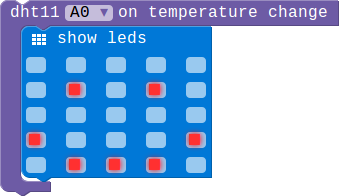

## DHT11 Module

### Introduction

This DHT11 Temperature & Humidity Sensor features a temperature & humidity sensor complex with a calibrated digital signal output. It can get temperature and humidity in the environment

#### Features

> TODO:Need hardware engineers to confirm this module's specific parameters.

| Module  | Measurement Range |Humidity Accuracy | Temperature Accuracy | 
|------------|----------------------------|--------------------------|-------------------------------|
| DHT11   | 20-90%RH / 0-50 ℃  |  ±5％RH                 |    ±2℃                          |

### Block API

#### 1.Get the temperature

Get current temperature,you can configure the format of the temperature in Celsius or Fahrenheit.

> 

> function DHTGetTemperature(connName: ConnName, style: DHTTemStyle): number;

> #### Parameters

> **connName** is the connector's name.this module can be pluged into both analog connector and digital connector.

> **style** is the format of the temperature.you can choose Celsius or Fahrenheit.

#### 2.Get humidity

Get current humidity.

> 

> function DHTGetHumidity(connName: ConnName): number;

> #### Parameters

> **connName** is the connector's name.this module can be pluged into both analog connector and digital connector.

#### 3.Temperature change event

Configure the MCU check the temperature periodically, and then execute the associated code block whenever the temperature changes.The smallest unit of changing is 1 degrees Celsius.

> 

> function onDHTEvent(connName: ConnName, body: () => void): void;

> #### Parameters

> **connName** is the analog connector's name.this module can be pluged into both analog connector and digital connector.

### Example

#### 1. Use button to get the temperature and humidity

> This example show you how to use the button A and B to get the temperature and humidity.When you press the button A the screen will show the current temperature,if the button is B it will show the humidity.

> 

#### 2. Temperature change event

> When the temperature changes the screen will show a smile face!

> 
