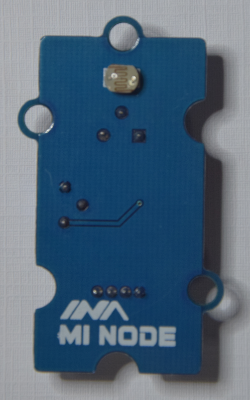
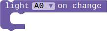
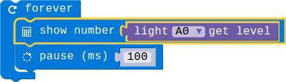
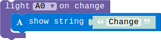

## Light Sensor Module

### Introduction

The Light Sensor Module can be used to detect the intensity of light in the environment.We divide the brightness into 5 levels.This module can only be pluged into analog connector(A0,A1 and A2).

### Block API

#### 1.Get the light level

Get the current light level, we divide the light intensity into 5 levels,from 1 to 5.1 represents brightest and 5 represents darkness.

> 

> function LightSensorGetLevel(connName: AnalogConnName): number;

> #### Parameters

> **connName** is the analog connector's name.this module can only be pluged into analog connector A0,A1 and A2.

#### 2.Light Sensor event

Configure the MCU check the light level periodically, and then execute the associated code block whenever the light level changes.

> 

> function onLightSensorEvent(connName: AnalogConnName, body: () => void): void;

> #### Parameters

> **connName** is the analog connector's name.this module can only be pluged into analog connector A0,A1 and A2.

### Example

#### 1. Show the light level

> This example show you how to get the current light level,and show it on the LED screen.

> 

#### 2. Light level change event!

> When the light level changes there will show a string on the screen.

> 
