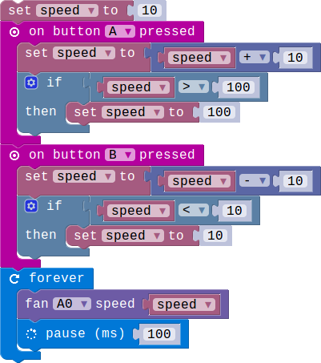

## Mini Fan Module

### Introduction

The mini fan module contains a DC motor and  orbit fan.we can control the speed of the motor according to different situation.

### Block API

#### 1.Control the motor speed

We use this block to control the motor's speed.you can change the speed by adjustmenting the second parameter,range from 0 to 100.

> 

> function FanControl_1(connName:AnalogConnName , speed:number): void

> #### Parameters

> ** connName ** is the analog connector's name.this module can only be pluged into analog connector and digital connector.

> ** speed ** is the speed of the motor.The adjustment range is from 0 to 100.0 means the motor is shuting down and 100 means the fastest speed. 

### Example

#### 1. Use button to control the motor's speed.

> This example show you how to use the button A and B control the motor speed . Button A control the motor to speed up, button B control the motor deceleration.

> 
