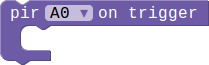
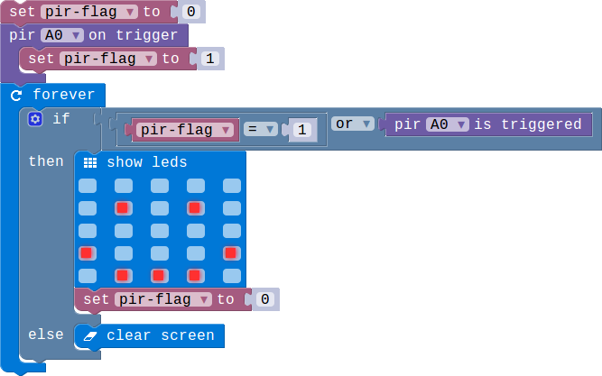

## PIR Module

### Introduction

The PIR Motion Sensors allows user to sense motion, usually human movement in its range.When this module detects that there is an object moving, it will jump from the low level to the high level, and keep the high level for 3 seconds.

### Block API

#### 1.Check the pir status

Check whether the switch is triggered or not.when the pir module is triggered the status signal will be in high level.

> 

> function PIRIsTriggered(connName: ConnName): boolean;

> #### Parameters

> **connName** is the connector's name.this module can be pluged into both analog connector and digital connector.

#### 2.PIR event

Configure the specified pin for digital input, and then execute the associated code block whenever the pin in rising edge which means the pir has detected movemwnt.

> 

> function onPIREvent(connName: ConnName, body: () => void): void;

> #### Parameters

> **connName** is the connector's name.this module can  be pluged into both analog connector and digital connector.

### Example

#### 1. Detecting the movement

> When the PIR detect the moving objects,the screen will show a smile face.when there are no moving things in it range it will show nothing.

> 

