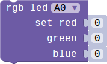

## Mini Fan Module

### Introduction

A colorful LED. The color and brightness can be programable.the color and brightness is controled by the gray value of  red,green and blue. 

### Block API

#### 1.Choose a RGB color

You can choose a given color to show.

> 

> function RGBChooseColor(connName: ConnName, color: MiNodeColor): void;

> #### Parameters

> **connName** is the analog connector's name.this module can be pluged into both analog connector and digital connector.

> **color** is set of color.That is red,green,blue,yellow,pink,cyan and white.you can choose a color to light you RGB.

#### 2.Set a specific RGB color by setting rgb gray value

You can change the color of the RGB by setting the three gray values.

> 

> function RGBSetColor(connName: ConnName, red: number, green: number, blue: number): void;

> #### Parameters

>  **connName** is the analog connector's name.this module can be pluged into both analog connector and digital connector.

 >  **red** is the gray value of red,range from 0 to 255. 

 >  **green** is the gray value of green,range from 0 to 255. 

 >  **blue** is the gray value of blue,range from 0 to 255. 

### Example

#### 1. Use button to show different color.

> When you press button A the RGB module will show red,if you press button B it will be green.

> 

#### 2. Set specific color

> This example show you how to set a specific color.There are two different color controled by button A and B.press the two button you will get the corresponding color.

> 

