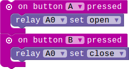

## Relay Module

### Introduction

The relay is an electrically operated switch.It is an digital switch can be used to control high-votage electrical devices. (maximum 250V)

### Block API

#### 1.Set relay status(open/close)

Check whether the switch is triggered right now.when the pir is triggered
the status line will be in high level.

> 

> function RelayControl(connName:ConnName , status:FanStatus): void

> #### Parameters

> **connName** is the connector's name.this module can be pluged into both analog connector and digital connector.

> **status** is the status of the relay open or close.

### Example

#### 1. Control the relay by button

> Button A and B control the open and close of the relay.

> 

