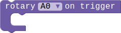
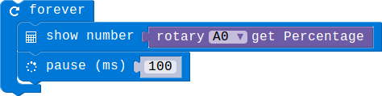
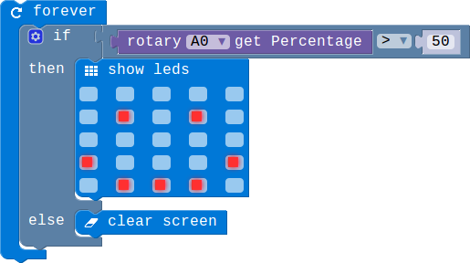
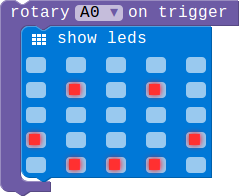

## Rotary Module

### Introduction

The Rotary can produce analog output between 0 and Vcc by adjust the angular range from 0 ~ 300.This module can only be pluged into analog connector(A0,A1 oand A2).

### Block API

#### 1.Get the percentage

Get the current rotary percentage.

> 

> function RotaryGetPercentage(connName: AnalogConnName): number;

> #### Parameters

> ** connName ** is the analog connector's name.this module can only be pluged into analog connector A0,A1 and A2.

#### 2.Light Sensor event

Configure the mcu check the rotary AD value periodically, and then execute the associated code block whenever the AD value changes.

> 

> function onRotaryEvent(connName: AnalogConnName, body: () => void): void;

> #### Parameters

> ** connName ** is the analog connector's name.this module can only be pluged into analog connector A0,A1 and A2.

### Example

#### 1. Show the percentage

> This example show you how to get the current percentage,and show it on the LED screen.

> 

#### 2. Rotary control the LED show

> When the percentage is smaller than 50 there will show nothing,otherwise there will be a smile face on the LED screen.

> 

#### 3. Rotary change event

> When you rotating the potentiometer's knob ,the LED screen will show a smile face.

> 
