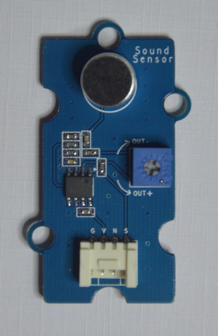
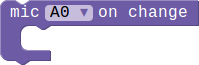
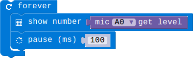
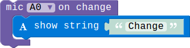

## Sound Sensor Module

### Introduction

The Sound Sensor Module can be used to detect the sound strength of the environment.We divide the sound into 5 levels,you can use our block to get the curren level.This module can only be pluged into analog connector(A0,A1 oand A2).

#### Features

> TODO:Need hardware engineers to add this module's specific parameters.

### Block API

#### 1.Get the sound level

Get the current sound level, we divide the sound into 5 levels,range from 1 to 5.which 1 represent quiet and 5 represent noisy.

> 

> function MICGetLevel(connName: AnalogConnName): number;

> #### Parameters

> **connName** is the analog connector's name.this module can only be pluged into analog connector A0,A1 and A2.

#### 2.Sound Sensor event

Configure the mcu check the sound level periodically, and then execute the associated code block whenever the sound level change.

> 

> function onMICEvent(connName: AnalogConnName, body: () => void): void;

> #### Parameters

> **connName** is the analog connector's name.this module can only be pluged into analog connector A0,A1 and A2.

### Example

#### 1. Show the sound level

> This example show you how to get the current sound level,and show the level number on the LED screen.

> 

#### 2. Sound level change event

> When the sound level changes a string will show on the screen.

> 
