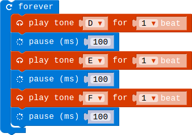

## Speaker Module

### Introduction

The Speaker can be used to make a sound by using the Music block.As the default music is speaking through pin P0,so we need to connect our speaker module to A0.

### Example

#### 1. Let your speaker make a sound

> The speaker will circle the sound of the three beat.

> 

