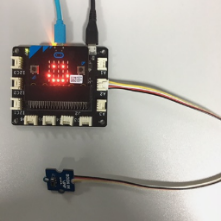
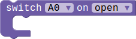
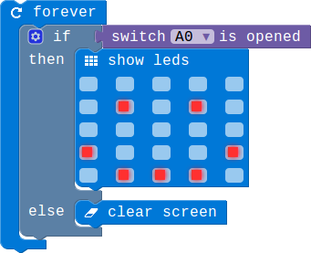
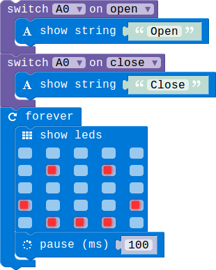

## Switch Module

### Introduction

The switch module can used to switch ON/OFF.

### Block API

#### 1.Check the switch's status

Check whether the switch is openeded right now.

> 

> function switchIsOpened(connName: ConnName): boolean;

> #### Parameters

> **connName** is the connector's name.this module can be pluged into both analog connector and digital connector.

#### 2.Switch event

Configure the specified pin for digital input, and then execute the associated code block whenever the switch is opened or closed.

> 

> function onSwitchEvent(connName: ConnName, event: SwitchEvent, body: () => void): void;

> #### Parameters

> **connName** is the analog connector's name.this module can  be pluged into both analog connector and digital connector.

> **event** represent two status of switch,open and close.

### Example

#### 1. Switch control the screen show

> If the switch is opened there will show a smile face on the screen,otherwise there will show nothing.

> 

#### 2. Show something when switch is opened/closed

> When the switch is opened,the led screen will show a string 'Open'.if the switch is closed,the led screen will show 'Close'

> 

