# Mi:Node Kit User Manual

[TOC]

# Introduction

The Mi:Node kit is a modular, safe and easy to use group of items that allow kids to minimize the effort required to get started with IOT learning with Micro:bit.

For this kit, there is no need for soldering, plug then use, the construction of the working circuit can be done within one minute.

### Features

- It is modular, safe and ready-to-use just like Lego
- 10 sensor modules include environmental monitoring, user interface and physical monitoring can be built a lot of cool projects include wearable device and smart home, etc.
- It is expandable and reusable
- Rich education guide document and many project stories

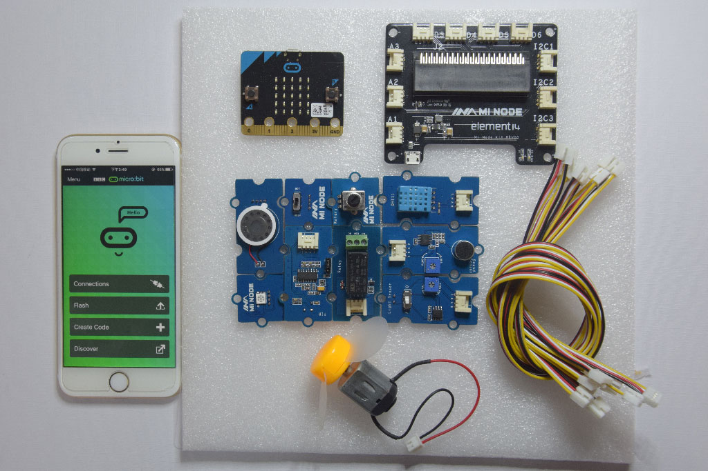

# What is the Kit?

### What is it include?


| Category           | Module                          | Quantity | Conector Type     | Description                              |
| ------------------ | ------------------------------- | -------- | ----------------- | ---------------------------------------- |
| Micro:bit          | Micro:bit Main Board            | 0        | NA                | The Micro:bit is not include in the kit  |
| Connect Board      | Connect Board                   | 1        | NA                | This a bridge between the micro:bit and sensor modules |
| Sensor Module (10) | Light Sensor                    | 1        | Analog Input      | It can be used to detect the intensity of light in the environment |
|                    | Temperature and Humidity Sensor | 1        | Analog Input      | It can get temperature and humidity in the environment |
|                    | Sound Sensor                    | 1        | Analog Input      | It can detect the sound strength of the environment |
|                    | Rotary Angle                    | 1        | Analog Input      | It can produce analog output between 0 and Vcc by adjust the angular range from 0 ~ 300. |
|                    | Mini Fan                        | 1        | Analog Output/PWM | A DC motor + orbit fan                   |
|                    | Speaker                         | 1        | Analog Output/PWM | Voice output speaker                     |
|                    | PIR Motion Sensor               | 1        | Digital Input     | It allows user to sense motion, usually human movement in its range |
|                    | RGB LED                         | 1        | Digital Output    | A colorful LED. The color and brightness can be programable |
|                    | Switch                          | 1        | Digital Input     | It can used to switch ON/OFF             |
|                    | Relay                           | 1        | Digital Output    | It is an digital switch can be used to control high-votage elecrical devices. (maximum 250V) |
| Cables             | Universal 4 Pin Buckled Cable   | 8        | NA                | 20cm cable x 2, 10cm cable x 6           |
|                    | Micro-B USB cable               | 2        | NA                | 1 for power input, 1 for micro:bit program upload |

### How it works

The kit is composed of a connect board and several sensor modules. The connect board is a bridge between the micro:bit main board and the sensor modules. It converts the micro:bit edge connector into serveral E-brick connector. The sensor modules can be attached to it by cable.

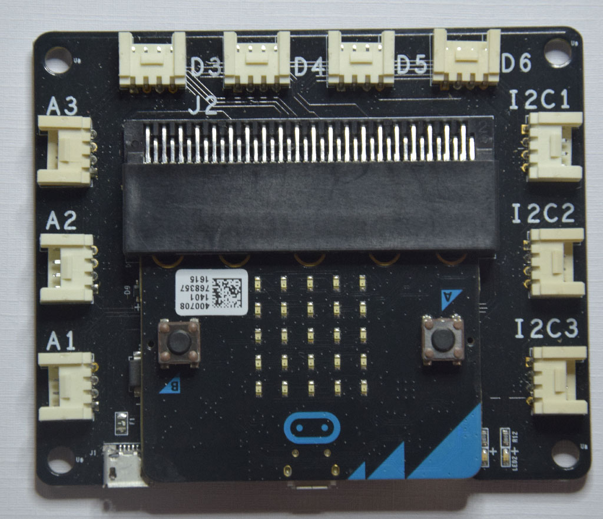

#### E-brick Connector

The E-brick connectors are compatible with the standard Grove from Seeed. It¡¯s a 2.0mm 1x4 connector. With signals include: 1 VCC, 1GND, 2 analog / digital signal.

An E-brick connector have 4 pins:

| Pin ID | Pin  Name | Description                              |
| ------ | --------- | ---------------------------------------- |
| Pin#1  | Signal#1  | Connect to a micro:bit pin with analog in / digital io / i2c function |
| Pin#2  | Signal#2  | Same to Signal#1. The Signal#2 is often not used, because 1 signal pin is enough for most sensor modules |
| Pin#3  | VCC       | Power pin                                |
| Pin#4  | GND       | Power pin                                |

There are 3 types of the connector:
- 3 analog input connectors
- 3 I2C connectors
- 4 digital IO connectors

##### E-brick Connector - Analog In/PWM Type

| Pin ID | Pin Name | Remark                                   |
| ------ | -------- | ---------------------------------------- |
| Pin#1  | A1       | Connect to a micro:bit pin with analog input/PWM function |
| Pin#2  | A2       | Same to A1, but most sensor module may not use the A2 pin |


##### E-brick Connector - Digital IO Type

| Pin ID | Pin Name | Remark                                   |
| ------ | -------- | ---------------------------------------- |
| Pin#1  | D1       | Connect to a micro:bit pin with digital io function |
| Pin#2  | D2       | Same to D1, but most sensor module may not use the D2 pin |

##### E-brick Connector - IIC Type

[IIC (Inter-Integrated Circuit)](https://en.wikipedia.org/wiki/I%C2%B2C), pronounced I-squared-C, is a multi-master, multi-slave, single-ended, serial computer bus invented by Philips Semiconductor (now NXP Semiconductors). It is typically used for attaching lower-speed peripheral to microcontrollers in short-distance, intra-board communication.

There are some sensor modules based on the IIC bus. We can attach serveral modules on the same bus, Because they can be identificated by different addresses.

| Pin ID | Pin Name | Remark                                   |
| ------ | -------- | ---------------------------------------- |
| Pin#1  | IIC SCL  | IIC clock signal. Connect to micro:bit pin19 |
| Pin#2  | IIC  SDA | IIC data signal. Connect to micro:bit pin20 |


#### Conversation on Remaping Micro:bit Edge Pin

Please note the Connector Name. There is a convention in the connector name. A connector name can be indicated the mapped micro:bit signal name.

For example: Connector D12 means: The Signal#1 is remapped to micro:bit pin 12, and Signal#2 is remapped to micro:bit pin 13(12+1)

It's useful for us to position the micro:bit pin quickly when develop code.

| Connector Type | Connector Name | Micro:bit Pin Name(Signal#1, Signal#2) |
| -------------- | -------------- | -------------------------------------- |
| Analog Input / | A0             | pin0, pin1                             |
| Digital IO     | A1             | pin1, pin2                             |
|                | A2             | pin2, pin3                             |
| Digital IO     | D12            | pin12, pin13                           |
|                | D13            | pin13, pin14                           |
|                | D14            | pin14, pin15                           |
|                | D15            | pin15, pin16                           |
| IIC            | IIC            | pin19, pin20                           |
|                | IIC            | pin19, pin20                           |
|                | IIC            | pin19, pin20                           |

- We usually use A0, A1, A2 as a analog input connector, but it can also be used as a digital io connector.
- D12, D13, D14, D15 can be only used as digital IO connector.
- 3 IIC can be only used as IIC connector.

### How to use it

Just plug then use it, That's easy.

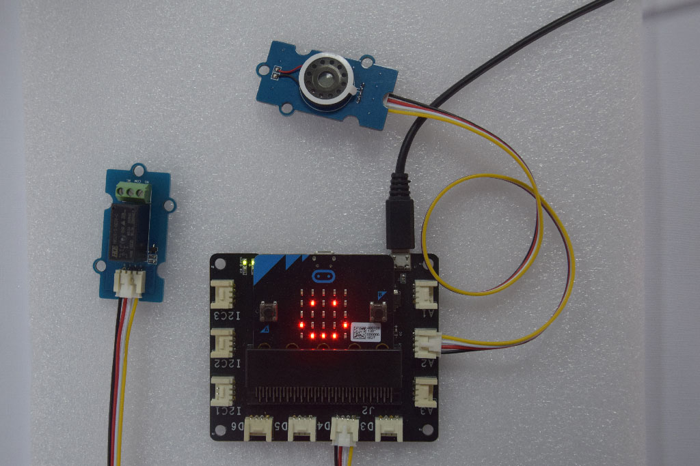


# Programming with the kit

As you know, There are 5 editors we can chose on micro:bit official website.
- Microsoft PXT
- Code Kingdoms JavaScript
- Microsoft Block Editor
- Microsoft Touch Develop
- python

We'll focus more on the **Microsoft PXT**.

### Work with our library

We'll develop the libraries for the sensor modules. This can reduce your effort on using the modules.You don't have to study the technical details of the modules. For example, The RGB LED is based on the IIC bus, We just need to call the library function to control the color and brightness. We don't care the IIC bus itself.

With the library, you don't need to care which pin a module connects to, You just need to know what E-brick connector is used.

> **NOTE**
>
> The library is based on Microsoft PXT.

#### Steps

- Step 1: Add our library to your code
- Step 2: Refer to the API reference or example code
- Step 3: Drag the library blocks.

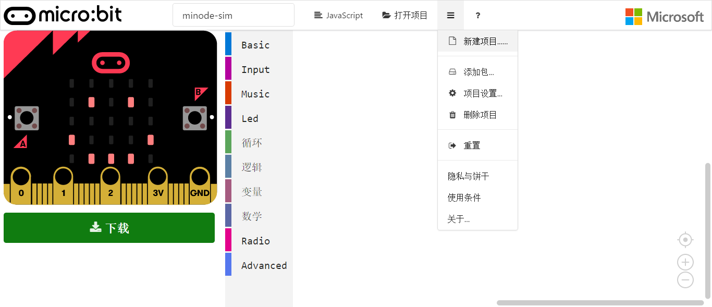


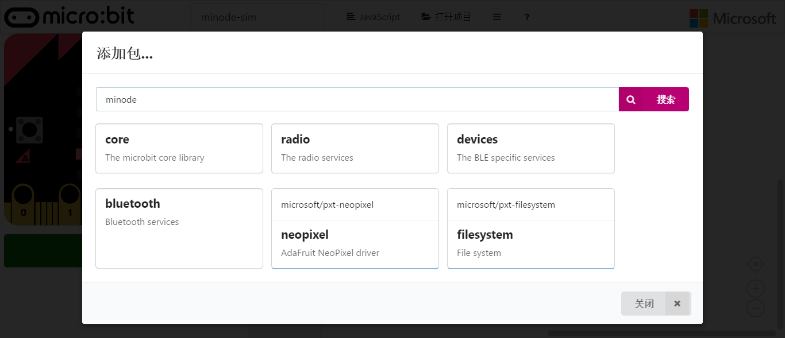


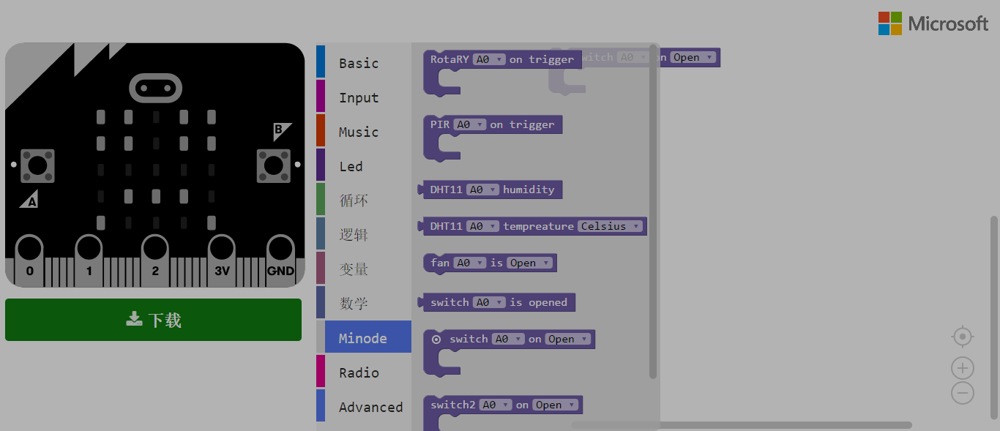

### Work without our library

You can also use the micro:bit pin library to control the sensor modules directly. In this situation, We can get the micro:bit pin ID by the E-brick connector ID. For example, We connect a sensor module to `D12`. Then We can get that the corresponding Micro:bit pin is `pin12`.


# Modules Usage & API Reference


## Light Sensor

The Light Sensor module can be used to detect the intensity of light in the environment.We divide the brightness into 5 levels.This module can only be pluged into **Analog connector(A0, A1 and A2)**.


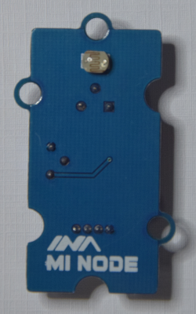

| Module       | Connect Type | Available Connectors |
| ------------ | ------------ | -------------------- |
| Light Sensor | Analog       | A0, A1, A2           |

> **TODO** 
> [HW Team] Need hardware engineers to add this module's specific parameters.


### Block API

#### Get the light level

Get current light level, we divide the light intensity into 5 levels,from 1 to 5.which 1 represents brightest and 5 represents darkness.


```typescript
function LightSensorGetLevel(connName: AnalogConnName): number;
```

##### Parameters

- **connName** is the analog connector's name.this module can only be pluged into analog connector A0,A1 and A2.

#### Light Sensor event

Configure the MCU check the light level periodically, and then execute the associated code block whenever the light level changes.

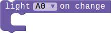

```typescript
function onLightSensorEvent(connName: AnalogConnName, body: () => void): void;
```

##### Parameters

- **connName** is the analog connector's name.this module can only be pluged into analog connector A0,A1 and A2.

### Example

#### Show the light level

This example show you how to get the current light level,and show it on the LED screen.

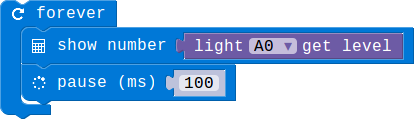

#### Light level change event

When the light level changes there will show a string on the screen.

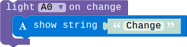


## DHT11(Temperature and Humidity Sensor)

This DHT11 Temperature & Humidity Sensor features a temperature & humidity sensor complex with a calibrated digital signal output. It can get temperature and humidity in the environment

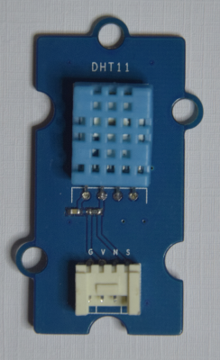


| Module | Connect Type | Available Connectors |
| ------ | ------------ | -------------------- |
| DHT11  | Digital IO   | D12, D13, D14, D15   |


> **TODO**
>
> Need hardware engineers to confirm this module's specific parameters.


| Module | Measurement Range | Humidity Accuracy | Temperature Accuracy |
| ------ | ----------------- | ----------------- | -------------------- |
| DHT11  | 20-90%RH / 0-50 ℃ | ±5％RH             | ±2℃                  |

### Block API

#### Get the temperature

Get current temperature,you can configure the format of the temperature in Celsius or Fahrenheit.


function DHTGetTemperature(connName: ConnName, style: DHTTemStyle): number;

##### Parameters

- **connName** is the connector's name.this module can be pluged into both analog connector and digital connector.

- **style** is the format of the temperature.you can choose Celsius or Fahrenheit.

#### Get humidity

Get current humidity.


```typescript
function DHTGetHumidity(connName: ConnName): number;
```

##### Parameters

- **connName** is the connector's name.this module can be pluged into both analog connector and digital connector.

#### Temperature change event

Configure the MCU check the temperature periodically, and then execute the associated code block whenever the temperature changes.The smallest unit of changing is 1 degrees Celsius.

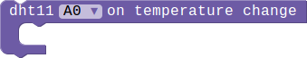

```typescript
function onDHTEvent(connName: ConnName, body: () => void): void;
```

##### Parameters

- **connName** is the analog connector's name.this module can be pluged into both analog connector and digital connector.

### Example

#### Use button to get the temperature and humidity

This example show you how to use the button A and B to get the temperature and humidity.When you press the button A the screen will show the current temperature,if the button is B it will show the humidity.

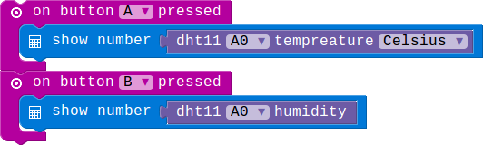

#### Temperature change event

When the temperature changes the screen will show a smile face!

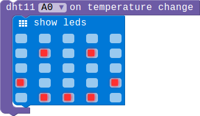

## Sound Sensor

The Sound Sensor Module can be used to detect the sound strength of the environment.We divide the sound into 5 levels,you can use our block to get the curren level.This module can only be pluged into analog connector(A0,A1 oand A2).

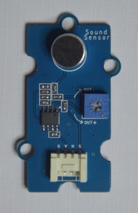


| Module       | Connect Type | Available Connectors |
| ------------ | ------------ | -------------------- |
| Sound Sensor | Analog       | A0, A1, A2           |


> **TODO** 
> [HW Team] Need hardware engineers to add this module's specific parameters.

### Block API

#### Get sound level

Get current sound level, we divide the sound into 5 levels,range from 1 to 5.which 1 represent quiet and 5 represent noisy.


```typescript
function MICGetLevel(connName: AnalogConnName): number;
```

##### Parameters

- **connName** is the analog connector's name.this module can only be pluged into analog connector A0,A1 and A2.

#### Sound Sensor event

Configure the mcu check the sound level periodically, and then execute the associated code block whenever the sound level change.

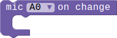

```typescript
function onMICEvent(connName: AnalogConnName, body: () => void): void;
```

##### Parameters

- **connName** is the analog connector's name.this module can only be pluged into analog connector A0,A1 and A2.

### Example

#### Show the sound level

This example show you how to get the current sound level,and show the level number on the LED screen.

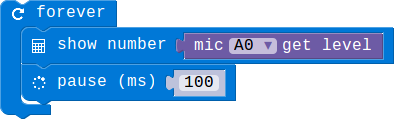

#### Sound level change event

When the sound level changes a string will show on the screen.

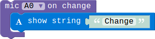


## Rotary Module

The Rotary can produce analog output between 0 and Vcc by adjust the angular range from 0 ~ 300.This module can only be pluged into analog connector(A0,A1 oand A2).

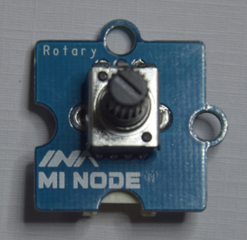

| Module        | Connect Type | Available Connectors |
| ------------- | ------------ | -------------------- |
| Rotary Sensor | Analog       | A0, A1, A2           |


> **TODO**
> [HW Team] Need hardware engineers to add this module's specific parameters.

### Block API

#### Get the percentage

Get the current rotary percentage.This value means how much you have rotated the rotary module.


```typescript
function RotaryGetPercentage(connName: AnalogConnName): number;
```

##### Parameters

- **connName** is the analog connector's name.this module can only be pluged into analog connector A0,A1 and A2.

#### Light Sensor event

Configure the mcu check the rotary AD value periodically, and then execute the associated code block whenever the AD value changes.

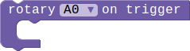

```typescript
function onRotaryEvent(connName: AnalogConnName, body: () => void): void;
```

##### Parameters

- **connName** is the analog connector's name.this module can only be pluged into analog connector A0,A1 and A2.

### Example

#### Show the percentage

This example show you how to get the current percentage,and show it on the LED screen.

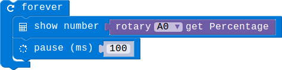

#### Rotary control the LED show

When the percentage is smaller than 50 the screen will show nothing,otherwise there will be a smile face on the screen.

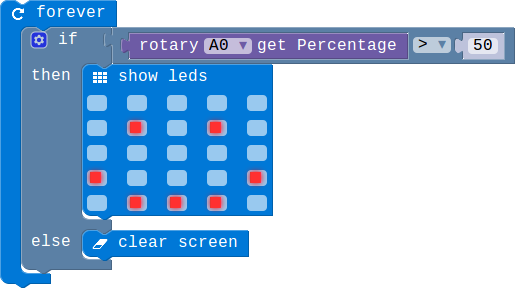

#### Rotary change event

When you rotating the potentiometer's knob ,the LED screen will show a smile face.

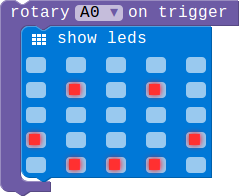

## Mini Fan Module

The mini fan module contains a DC motor and  orbit fan.we can control the speed of the motor according to different situations.

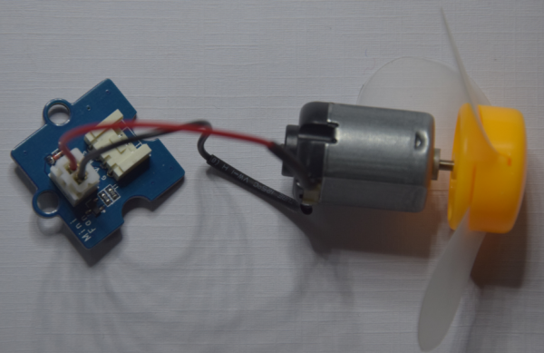

| Module          | Connect Type | Available Connectors |
| --------------- | ------------ | -------------------- |
| Mini Fan Module | Analog       | A0, A1, A2           |


> **TODO**
> [HW Team] Need hardware engineers to add this module's specific parameters.

### Block API

#### Control the motor speed

We use this block to control the motor's speed.you can change the speed by adjustmenting the second parameter,range from 0 to 100.


```typescript
function FanControl_1(connName:AnalogConnName , speed:number): void
```

##### Parameters

- **connName** is the analog connector's name.this module can only be pluged into analog connector and digital connector.

- **speed** is the speed of the motor.The adjustment range is from 0 to 100.which 0 means the motor is shuting down and 100 means the fastest speed. 

### Example

#### Use button to control the motor's speed.

This example show you how to use the button A and B control the motor speed . Button A control the motor to speed up, button B control the motor to deceleration.

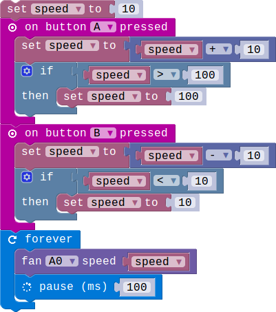

## Speaker Module

The Speaker can be used to make a sound by using the Music blocks.

>  **NOTE**
>
>  As the default music is speaking through **pin P0**,so we need to connect our speaker module to **connector A0**.


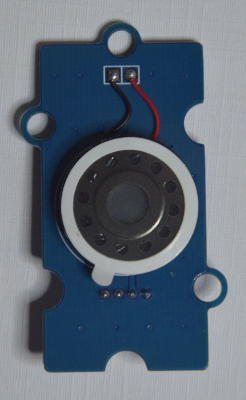


| Module         | Connect Type | Available Connectors |
| -------------- | ------------ | -------------------- |
| Speaker Module | Analog       | A0                   |


> **TODO**
> [HW Team] Need hardware engineers to add this module's specific parameters.

### Example

#### Let your speaker make a sound

The speaker will circle the sound of the three beat.

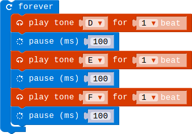


## PIR Module

The PIR Motion Sensors allows user to sense motion, usually human movement in its range.When this module detects that there is an object moving, the PIR signal line will jump from the low level to the high level, and keep the high level for 3 seconds.

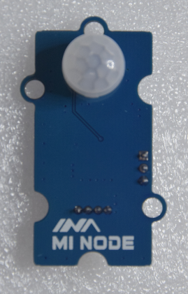

| Module     | Connect Type | Available Connectors |
| ---------- | ------------ | -------------------- |
| PIR Module | Digital IO   | D12, D13, D14, D15   |


> **TODO**
> [HW Team] Need hardware engineers to add this module's specific parameters.

### Block API

#### Check the PIR status

Check whether the switch is triggered or not.when the pir module is triggered the status signal which was detected will be in high level.


```typescript
function PIRIsTriggered(connName: ConnName): boolean;
```

##### Parameters

- **connName** is the connector's name.this module can be pluged into both analog connector and digital connector.

#### PIR event

Configure the specified pin for digital input, and then execute the associated code block whenever the pin in rising edge which means the PIR has detected movemwnt.

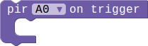

```typescript
function onPIREvent(connName: ConnName, body: () => void): void;
```

##### Parameters

- **connName** is the connector's name.this module can  be pluged into both analog connector and digital connector.

### Example

#### Detecting the movement

When the PIR detected the moving objects,the screen will show a smile face.when there are no moving things in it range the screen will show nothing.

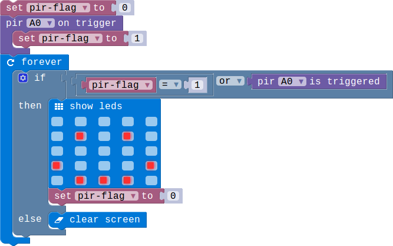


## RGB LED

A colorful LED. The color and brightness can be programable. And the color and brightness is controled by the gray value of  red, green and blue. 

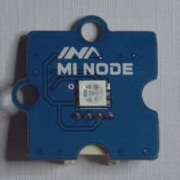

| Module  | Connect Type | Available Connectors |
| ------- | ------------ | -------------------- |
| RGB LED | Digital IO   | D12, D13, D14, D15   |


> **TODO**
> [HW Team] Need hardware engineers to add this module's specific parameters.

### Block API

#### Choose a RGB color

You can choose a given color to show.


```typescript
function RGBChooseColor(connName: ConnName, color: MiNodeColor): void;
```

##### Parameters

- **connName** is the analog connector's name.this module can be pluged into both analog connector and digital connector.
- **color** is set of colors.That is red,green,blue,yellow,pink,cyan and white.you can choose one color from the given color to light up you RGB module.

#### Set a specific RGB color by setting rgb gray value

You can change the color of the RGB by setting the three gray values.

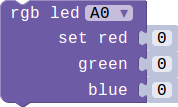

```typescript
function RGBSetColor(connName: ConnName, red: number, green: number, blue: number): void;
```

##### Parameters

- **connName** is the analog connector's name.this module can be pluged into both analog connector and digital connector.
- **red** is the gray value of red,range from 0 to 255. 
- **green** is the gray value of green,range from 0 to 255. 
- **blue** is the gray value of blue,range from 0 to 255. 

### Example

#### Use button to show different color.

When you press button A the RGB module will show red,if you press button B the color will be green.

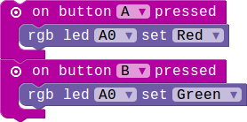

#### Set specific color

This example show you how to set a specific color.There are two different color controled by button A and B.press the two button you will get the corresponding color.

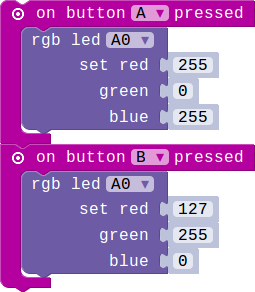

## Switch Module

The switch module can used to switch ON/OFF.

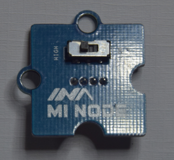

| Module        | Connect Type | Available Connectors |
| ------------- | ------------ | -------------------- |
| Switch Module | Digital IO   | D12, D13, D14, D15   |


> **TODO**
> [HW Team] Need hardware engineers to add this module's specific parameters.

### Block API

#### Check the switch's status

Check whether the switch is openeded or not.


```typescript
function switchIsOpened(connName: ConnName): boolean;
```

##### Parameters

- **connName** is the connector's name.this module can be pluged into both analog connector and digital connector.

#### Switch event

Configure the specified pin for digital input, and then execute the associated code block whenever the switch is opened or closed.

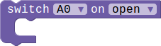

```typescript
function onSwitchEvent(connName: ConnName, event: SwitchEvent, body: () => void): void;
```

##### Parameters

- **connName** is the analog connector's name.this module can  be pluged into both analog connector and digital connector.
- **event** represent two status of switch,open and close.

### Example

#### Switch control the screen show

If the switch is opened the screen will show a smile face ,otherwise it will show nothing.


#### Show the switch module's status

In this example we use the switch event to show the switch's status. When the switch is opened, the led screen will show a string 'Open', otherwise the led screen will show 'Close'.

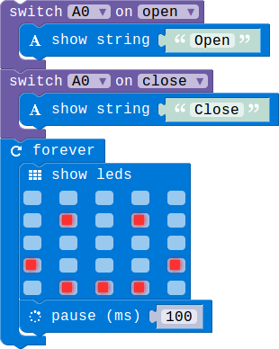

## Relay Module

The relay is an electrically operated switch. It is an digital switch can be used to control high-votage electrical devices, such as some home appliances. (maximum 250V)

> **Danger**
>
> It's dangerous for kid to attach the relay module to a AC(110V/220V) device.  Our purpose for this module is just showing how to control home appliances.  You can hear some sound when you switch the relay **ON/OFF**. You do not have to connect to a real appliance. 


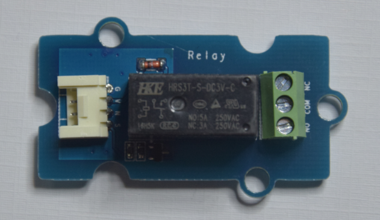


| Module       | Connect Type | Available Connectors |
| ------------ | ------------ | -------------------- |
| Relay Module | Digital IO   | D12, D13, D14, D15   |


> **TODO**
> [HW Team] Need hardware engineers to add this module's specific parameters.

### Block API

#### Set relay status(open/close)

Set the relay module's status open/close.


```typescript
function RelayControl(connName:ConnName , status:FanStatus): void
```

##### Parameters

- **connName** is the connector's name.this module can be pluged into both analog connector and digital connector.
- **status** is the status of the relay open or close.

### Example

#### Control the relay by button

Button A and B control the open and close of the relay module.

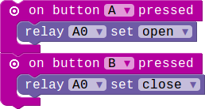


# Appendix


## Microsoft PXT


- Home: https://pxt.microbit.org/
- Getting Started: https://pxt.microbit.org/getting-started 
- Reference Manual: https://pxt.microbit.org/reference/


## Support


- Email: support@embest-tech.com
- Website: http://minode.embest-tech.com
- Github repo: http://github.com/minodekit